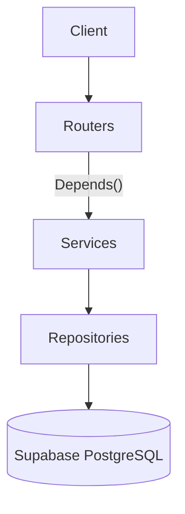

# Waga Index Backend - Agent Guide

REST API and data pipeline for collecting Ethiopian market prices, reviewing submissions,
computing auditable market-price index values, and serving institutional data exports.

This repository contains a minimal FastAPI scaffold and the initial database schema.
`plan.md` defines the approved target and tracks the remaining implementation iterations.

## Architecture

Use FastAPI dependency injection and this request flow:

```text
HTTP Request
    |
    v
Routers (app/api/routes/)       - paths, schemas, status codes
    |
    v Depends(get_*_service)
Services (app/services/)        - business logic and transactions
    |
    v
Repositories (app/repositories/) - SQLAlchemy queries and persistence
    |
    v
SQLAlchemy ORM / Supabase PostgreSQL
```



Do not add a controller layer. Routers perform HTTP-specific mapping and delegate business
behavior to services.

## Target Directory Layout

```text
app/
|-- main.py
|-- config.py
|-- database.py
|-- dependencies.py
|-- api/
|   |-- router.py
|   `-- routes/
|       |-- health.py
|       |-- auth.py
|       |-- reference_data.py
|       |-- submissions.py
|       |-- reviews.py
|       |-- prices.py
|       |-- coverage.py
|       `-- exports.py
|-- models/                  # SQLAlchemy declarative ORM models
|-- schemas/                 # Pydantic API request/response models
|-- repositories/            # Database access only
|-- services/                # Business workflows
`-- commands/                # Seed, rebuild, and maintenance commands

migrations/
`-- versions/

seed_data/
tests/
|-- unit/
|-- integration/
`-- api/
```

Create directories only when the approved implementation needs them. Do not add empty
placeholder packages for deferred features.

## Layer Rules

| Layer | Responsibility | Must not |
|---|---|---|
| Routers | Paths, status codes, request/response schemas, dependency injection | Contain SQL or core business rules |
| Services | Workflows, validation of business invariants, transaction boundaries | Know SQL details or construct HTTP responses |
| Repositories | Typed SQLAlchemy reads and writes | Contain business policy or raise `HTTPException` |
| ORM models | Database tables and relationships | Double as API schemas |
| Pydantic schemas | API input and output contracts | Perform database access |
| Commands | Explicit maintenance and data-loading workflows | Run automatically during application startup |

## Dependency Injection

All dependency wiring belongs in `app/dependencies.py`.

```python
def get_submission_repository(
    session: AsyncSession = Depends(get_db_session),
) -> SubmissionRepository:
    return SubmissionRepository(session)


def get_submission_service(
    submissions: SubmissionRepository = Depends(get_submission_repository),
) -> SubmissionService:
    return SubmissionService(submissions)
```

Rules:

- Use FastAPI `Depends()`; do not introduce a custom dependency-injection container.
- Inject services into routers and repositories into services.
- Pass one `AsyncSession` through all repositories participating in a transaction.
- Services own commit and rollback decisions.
- Use `app.dependency_overrides` for tests.

## Adding an Endpoint

1. Add or update the Pydantic schema in `app/schemas/`.
2. Add the required database operation in `app/repositories/`.
3. Add the business workflow in `app/services/`.
4. Wire dependencies in `app/dependencies.py`.
5. Add the route under `app/api/routes/`.
6. Register the router in `app/api/router.py`.
7. Add unit, API, and integration coverage appropriate to the change.
8. Update `plan.md` or API documentation when the public contract changes.

## Database

- Use typed SQLAlchemy 2 declarative ORM models.
- Alembic is the only schema-management mechanism.
- Never call `Base.metadata.create_all()` in application startup.
- Never run Alembic from the FastAPI lifespan.
- Migrations must run successfully against an empty PostgreSQL database.
- Review autogenerated migrations before applying them.
- Keep PostgreSQL usage compatible with Supabase-managed PostgreSQL.

### Supabase Connections

Use separate connections for application traffic and migrations:

| Variable | Purpose |
|---|---|
| `WAGA_DATABASE_URL` | Supabase pooled async runtime connection |
| `WAGA_DATABASE_MIGRATION_URL` | Supabase direct connection for Alembic and maintenance |
| `WAGA_TEST_DATABASE_URL` | Isolated PostgreSQL integration-test database |

Requirements:

- Require SSL for Supabase connections.
- Do not commit credentials or production connection strings.
- Keep local PostgreSQL support through Docker Compose.
- Do not use Supabase Auth or generated REST APIs unless a later plan explicitly adds them.

## Data Integrity

Auditability is a product requirement.

- Submissions are append-only: never update or delete the original observation.
- Review decisions are separate records referencing submissions.
- Consent records are versioned and append-only.
- Index snapshots are derived, append-only, and reproducible from accepted submissions.
- A flagged or pending submission never contributes to an index value.
- Never impute, interpolate, carry forward, or silently fill missing prices.
- Below-threshold cells must return `insufficient_data`.
- Every exported price carries its status, supporting count, source composition, and licence
  classification.
- Missing licence classification is treated as the most restrictive class.

## Review Scope

The initial backend uses manual review:

- New REST submissions begin as `pending`.
- An operator can accept or flag a pending submission.
- Flagging requires a reason.
- Final decisions cannot be replaced by a conflicting decision.
- Accepting a submission triggers recomputation of only its market-commodity cell.

`VerificationRepository` persists review outcomes. Do not implement an automatic verification
service, IQR rules, baseline outlier rules, LLM decisions, or duplicate-scoring logic in the
current phase.

## Authentication

- Authentication is application-managed; Supabase is PostgreSQL hosting only.
- Passwords use Argon2id.
- Access tokens are 15-minute HS256 JWTs with fixed issuer and audience validation.
- Refresh tokens are opaque, rotate on use, expire after 30 days, and are stored only as
  SHA-256 hashes.
- Refresh-token reuse revokes the entire session family.
- Public registration creates contributor accounts only.
- Staff roles are `admin`, `operator`, and `viewer`; use `require_roles()` for protected routes.
- Create the first administrator explicitly with `uv run waga-create-admin`.
- Never accept a token-selected JWT algorithm or put refresh tokens in logs.

## Deferred Features

The following are intentionally outside the current implementation:

- Telegram bot and Telegram webhooks
- Voice submissions and audio retention
- ASR vendor integrations
- LLM parsing
- Automatic price verification
- Background workers, queues, and scheduled jobs
- Contributor accuracy scoring
- Payments or reward points
- Public institutional API authentication
- Forecasting and imputation

Do not add stubs, adapters, environment variables, database tables, or dependencies for these
features unless an approved later plan introduces them.

## Configuration

All application settings use the `WAGA_` prefix and are defined in `app/config.py`.
`.env.example` documents every supported variable without secrets.

Configuration must fail clearly at startup when a required production value is missing. Tests
must be able to override settings without importing a live production connection.

## Error Handling

- Routers translate domain exceptions into appropriate HTTP responses.
- Services raise typed domain exceptions and have no FastAPI imports.
- Repositories propagate database exceptions unless adding useful database context.
- Do not expose database errors, secrets, or stack traces in API responses.
- Use structured logs for operational failures.

## Commands

```bash
# Install and lock dependencies
uv sync

# Apply migrations
uv run alembic upgrade head

# Run locally
uv run uvicorn app.main:app --reload

# Quality checks
uv run ruff check .
uv run ruff format --check .
uv run mypy app
uv run pytest

# Local PostgreSQL
docker compose up -d db
```

Do not run formatters with rewrite flags unless the task includes code changes.

## Testing

- Unit tests isolate services with repository fakes.
- API tests use `httpx.AsyncClient` with FastAPI dependency overrides.
- Integration tests run against PostgreSQL, not SQLite.
- Migration tests start from an empty database and apply all migrations.
- Tests must cover append-only behavior, review transitions, licence filtering, index thresholds,
  deterministic rebuilds, and transaction rollback.
- Avoid importing application modules in tests in a way that requires live Supabase credentials.

## Do / Do Not

Do:

- Read `plan.md` before implementing features.
- Keep changes scoped to the approved iteration.
- Keep routers thin and repositories policy-free.
- Use decimal-safe database and Python types for money and weights.
- Preserve provenance and insufficient-data states in every read model.
- Add tests proportional to the behavioral risk.

Do not:

- Implement deferred Telegram, voice, or automatic verification features.
- Put SQL in routers or services.
- Put HTTP concerns in services or repositories.
- Create a generic repository framework for simple queries.
- Update or delete immutable observations and decisions.
- Run schema creation or migrations from application startup.
- Commit `.env`, Supabase credentials, or generated secrets.
