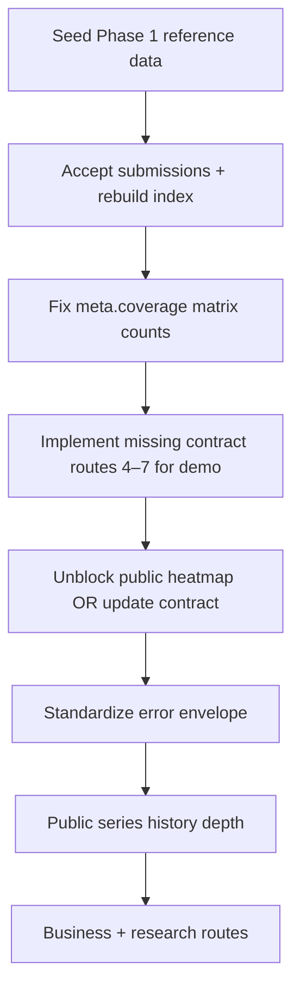

# API Endpoint Audit — OpenAPI vs Contract vs Live Server

**Date:** 2026-07-26  
**Server tested:** `http://127.0.0.1:8000` (FastAPI `/docs` + `/openapi.json`)  
**Contract source:** [`docs/api-contracts-v1.md`](api-contracts-v1.md)

This document records live `curl` results against the frozen v1 read contract, what is wrong today, and how to fix it.

---

## How to re-run the audit

```bash
# Core read surface (public, no auth)
curl -s http://127.0.0.1:8000/api/v1/health | python3 -m json.tool
curl -s http://127.0.0.1:8000/api/v1/reference | python3 -m json.tool
curl -s http://127.0.0.1:8000/api/v1/prices/current | python3 -m json.tool
curl -s 'http://127.0.0.1:8000/api/v1/prices/series?commodity=teff_mixed&from=2026-06-01&to=2026-07-25' | python3 -m json.tool
curl -s http://127.0.0.1:8000/api/v1/coverage | python3 -m json.tool

# Gated / missing contract endpoints
curl -s http://127.0.0.1:8000/api/v1/heatmap | python3 -m json.tool
curl -s http://127.0.0.1:8000/api/v1/exports/panel.csv
curl -s http://127.0.0.1:8000/api/v1/affordability
curl -s http://127.0.0.1:8000/api/v1/subscriptions/access | python3 -m json.tool

# List everything FastAPI exposes
curl -s http://127.0.0.1:8000/openapi.json | python3 -c \
  "import json,sys; [print(p) for p in sorted(json.load(sys.stdin)['paths'])]"
```

---

## Executive summary

| Category | Count | Notes |
|---|---:|---|
| Contract read endpoints | 22 | From `api-contracts-v1.md` NGO + business + research surface |
| Implemented in OpenAPI | 61 | Includes auth, agents, admin, subscriptions, webhooks |
| Contract reads **working** (200 + envelope) | 5 | `/reference`, `/prices/current`, `/prices/series`, `/coverage`, `/health` |
| Contract reads **implemented but gated** | 2 | `/heatmap` (403 public), `/exports/panel.csv` (401 without subscriber) |
| Contract reads **not implemented** | 15 | All return **404** |
| Empty-but-valid responses | 5 | Shape OK; DB has no seeded reference data or index rows |

**Bottom line:** Routing and envelope structure for the first Track B slice are mostly correct, but the demo cannot work end-to-end until reference data is seeded, the index is rebuilt, missing contract routes are added, and several contract mismatches (errors, validation, paywall scope) are resolved.

---

## Live test matrix (contract read surface)

| Endpoint | Expected (contract) | Live HTTP | Envelope | Data | Verdict |
|---|---|---:|---|---|---|
| `GET /health` | `{ "status": "ok" }` | 200 | N/A (non-envelope) | OK | ✅ Works |
| `GET /reference` | `meta` + markets/commodities/baskets | 200 | ✅ | Empty arrays | ⚠️ Shape OK, no seed data |
| `GET /prices/current` | `cells` + `city_prices` | 200 | ✅ | Empty | ⚠️ Shape OK, no index data |
| `GET /prices/series` | `interval` + `series[]` | 200 | ✅ | Empty series | ⚠️ Public tier history depth = 0 |
| `GET /coverage` | `matrix` + `worst_covered` | 200 | ✅ | Empty | ⚠️ Shape OK, no cells |
| `GET /heatmap` | Market heat payload | **403** | `detail.error` | — | ❌ Pro paywall blocks public demo |
| `GET /exports/panel.csv` | CSV download | **401** | FastAPI `detail` string | — | ⚠️ Expected for unauthenticated; needs subscriber + export tier |
| `GET /affordability` | Basket cost + score | **404** | — | — | ❌ Not implemented |
| `GET /alerts` | Spike alerts | **404** | — | — | ❌ Not implemented |
| `GET /meb/food-line` | MEB bridge | **404** | — | — | ❌ Not implemented |
| `POST /copilot/ask` | Cited recommendation | **404** | — | — | ❌ Not implemented |
| `POST /impact` | Impact block | **404** | — | — | ❌ Not implemented |
| `GET /business/cost-index` | Business index | **404** | — | — | ❌ Not implemented |
| `GET /business/sourcing` | Sourcing compare | **404** | — | — | ❌ Not implemented |
| `POST /business/benchmark` | Quote benchmark | **404** | — | — | ❌ Not implemented |
| `POST /business/ask` | Business copilot | **404** | — | — | ❌ Not implemented |
| `GET /research/snapshots` | Snapshot catalog | **404** | — | — | ❌ Not implemented |
| `GET /research/methodology` | Method JSON | **404** | — | — | ❌ Not implemented |
| `GET /research/codebook` | Column dictionary | **404** | — | — | ❌ Not implemented |

Additional non-contract routes in OpenAPI (auth, agents, admin, subscriptions, webhooks) respond as designed: protected routes return **401** without a bearer token.

---

## What is working correctly

### Standard envelope on implemented reads

Live responses from `/reference`, `/prices/current`, `/prices/series`, and `/coverage` include the contract envelope:

```json
{
  "meta": {
    "generated_at": "…Z",
    "method_version": "waga-index-v1",
    "city": "addis_ababa",
    "currency": "ETB",
    "window": { "start": "…Z", "end": "…Z", "hours": 72 },
    "coverage": { "cells_expected": 0, "cells_published": 0, "cells_insufficient": 0, "coverage_pct": 0.0 },
    "licence_class": "commercial_permitted",
    "snapshot_id": "snap_2026-07-25T21_v1"
  },
  "data": { }
}
```

Implementation lives in `app/services/read_meta.py` and `app/services/prices_read.py`.

### Subscription access matrix

`GET /api/v1/subscriptions/access` returns tier gating (public user → all pro features `allowed: false`). This matches the product paywall model, even though the response is **not** wrapped in the contract envelope.

### Heatmap + export services exist

- `app/services/heatmap.py` — heat band logic matches contract bands (`cool` / `stable` / `warm` / `hot` / `critical`).
- `app/services/exports.py` — CSV columns align with contract § exports.

Both are blocked at the route layer by subscription gates (`require_feature(GateFeature.MAP)` and `GateFeature.EXPORT`).

---

## Issues found (with fixes)

### 1. Empty reference data and index (blocks all meaningful responses)

**Observed**

```bash
curl -s http://127.0.0.1:8000/api/v1/reference
# "markets": [], "commodities": []
# meta.coverage.cells_expected: 0
```

**Expected (contract)**  
Markets and commodities populated from frozen Phase 1 codes; coverage reflects the full market×commodity matrix (e.g. 9×5 = 45 cells when fully seeded).

**Root cause**  
Reference catalogue not seeded in the running database. Index table has no published rows (or no rows at all).

**Fix**

```bash
# From repo root, with DB up and migrations applied
waga-seed-phase1          # markets + commodities + synonyms
# After accepted submissions exist:
waga-rebuild-index        # populate index_values from accepted submissions
```

Track A must also ensure review accept triggers recompute (see `docs/WORK_SPLIT.md` § on accept hook).

**Verify**

```bash
curl -s http://127.0.0.1:8000/api/v1/reference | python3 -c \
  "import json,sys; d=json.load(sys.stdin); print(len(d['data']['markets']), 'markets')"
curl -s http://127.0.0.1:8000/api/v1/prices/current | python3 -c \
  "import json,sys; d=json.load(sys.stdin); print(len(d['data']['cells']), 'cells')"
```

---

### 2. Fifteen contract endpoints return 404

**Observed**  
All NGO decision layer, business surface, and research surface routes from `api-contracts-v1.md` § NGO / Business / Research are absent from `app/api/router.py`.

**Expected**  
Routes registered under `/api/v1` per contract implementation order (endpoints 1–7 cover the demo).

**Fix (Track B — add routes + services)**

| Priority | Route | New files (suggested) |
|---:|---|---|
| 1 | `GET /affordability` | `app/services/affordability.py`, `app/api/routes/affordability.py` |
| 2 | `POST /copilot/ask` | `app/services/copilot.py`, `app/api/routes/copilot.py` |
| 3 | `POST /impact` | Can be handler in `copilot.py` or shared `impact.py` |
| 4 | `GET /alerts` | `app/services/alerts.py`, `app/api/routes/alerts.py` |
| 5 | `GET /meb/food-line` | Config-driven static ECWG refs + affordability hook |
| 6–9 | `/business/*` | `app/services/business.py`, `app/api/routes/business.py` |
| 10–12 | `/research/*` | `app/services/research.py`, `app/api/routes/research.py` |

Wire each new router in `app/api/router.py`. Add pytest coverage mirroring `tests/test_prices_api.py`.

---

### 3. Heatmap blocked for public users (403)

**Observed**

```json
{
  "detail": {
    "error": {
      "code": "tier_required",
      "message": "Feature 'map' requires a higher subscription tier"
    }
  }
}
```

**Expected (contract + demo story)**  
`GET /heatmap` is endpoint #5 in the contract implementation order and part of the NGO demo (`docs/api-contracts-v1.md` table). Contract auth rule: *public tier unauthenticated* for base reads; `full` / `research` need bearer for extended surfaces — heatmap is not listed as a paid-only surface in the contract itself.

**Root cause**  
`app/api/routes/heatmap.py` uses `require_feature(GateFeature.MAP)`, which denies public tier (`app/services/subscriptions.py` → `PRO_SURFACES`).

**Fix options (pick one product decision)**

1. **Demo-first (recommended for hackathon):** Remove `require_feature(GateFeature.MAP)` from heatmap route; keep map gating only on frontend premium UI if needed.
2. **Paywall-first:** Update `docs/api-contracts-v1.md` to document heatmap as Pro-only and adjust frontend to authenticate before map page.

Also align error shape (see §5).

---

### 4. Public `/prices/series` always empty

**Observed**  
Unauthenticated request with valid `commodity` returns `"series": []` even when index data exists.

**Expected**  
Contract shows series points for charts on public lookup (at minimum recent window).

**Root cause**  
`app/api/routes/prices.py` sets `history_depth = 0` when `optional_user is None`, and `PricesReadService.get_series` short-circuits to empty when `history_depth_days == 0`.

**Fix**

- Decide minimum public history (e.g. 7 or 30 days) in settings.
- Pass that depth for anonymous users instead of `0`.
- Keep deeper history and export behind Pro/Enterprise via existing subscription gates.

---

### 5. Error envelope does not match contract

**Contract**

```json
{ "error": { "code": "unknown_market", "message": "…", "field": "market" } }
```

**Observed patterns**

| Case | Live body |
|---|---|
| Tier required | `{ "detail": { "error": { "code": "tier_required", … } } }` |
| Missing auth | `{ "detail": "Invalid or expired access token" }` |
| Validation | `{ "detail": [ { "type": "missing", "loc": ["query","commodity"], … } ] }` |
| Unknown market | **200** with empty `cells` (no error) |

**Fix**

Add FastAPI exception handlers in `app/main.py`:

```python
@app.exception_handler(HTTPException)
async def http_exception_handler(request, exc):
    if isinstance(exc.detail, dict) and "error" in exc.detail:
        return JSONResponse(status_code=exc.status_code, content=exc.detail)
    return JSONResponse(
        status_code=exc.status_code,
        content={"error": {"code": "unauthorized", "message": str(exc.detail)}},
    )
```

For validation, map `422` → contract codes (`invalid_range`, etc.).

In `PricesReadService._resolve_catalog`, raise `HTTPException(400, detail={"error": {"code": "unknown_market", …}})` when a requested code is not found instead of silently dropping it.

---

### 6. `meta.coverage` under-counts expected cells

**Observed**  
With empty catalogue, `cells_expected: 0`. With data, `build_meta` sets `expected = len(latest_values)` (only cells that have index rows or synthetics for loaded catalogue).

**Expected**  
`cells_expected` = active markets × active commodities (full matrix), with `cells_published` / `cells_insufficient` derived from status — the honesty signal in the contract UI copy ("38 of 45 cells").

**Fix**  
In `build_meta` (or callers), pass explicit `matrix_size=len(markets)*len(commodities)` and count published/insufficient across the full matrix, including cells with no index row yet (`insufficient_data`).

---

### 7. OpenAPI `/docs` incomplete vs contract

**Observed**  
OpenAPI lists 61 paths; contract defines 22 read endpoints + write/auth surfaces. Missing contract paths do not appear in `/docs`, so frontend developers cannot discover them.

**Fix**  
Implement missing routes (§2). Optionally add `description`/`openapi_tags` linking each route to contract section anchors. Keep `docs/api-contracts-v1.md` as the semantic source of truth; OpenAPI is generated from code.

---

### 8. Export route auth vs contract tier wording

**Observed**  
`GET /exports/panel.csv` → 401 without token; 403 with public subscriber for export quota.

**Expected**  
Research tier export in contract; aligns with `GateFeature.EXPORT` gating.

**Fix**  
No route change needed if research tier is intentional. Document in contract auth table that exports require authenticated research/pro subscriber. Ensure 403 uses top-level `error` envelope (§5).

---

## Recommended fix order



1. **Data** — `waga-seed-phase1`, submissions, `waga-rebuild-index`
2. **Correctness** — coverage counts, unknown code errors
3. **Demo completeness** — `/affordability`, `/heatmap` access, `/copilot/ask`, `/impact`
4. **Polish** — error envelope, public series window, remaining business/research routes

---

## OpenAPI inventory (61 paths — not in contract doc)

These exist in `/docs` but are outside `api-contracts-v1.md` read surface:

- **Auth:** `/auth/register`, `/login`, `/refresh`, `/logout`, `/me`, `/subscriber/register`, …
- **Agents:** `/agents/applications`, `/agents/{telegram_id}/score`, redeem flows
- **Admin:** catalogue CRUD, reviews, dashboard, subscriptions, enterprise enquiries
- **Write path:** `POST /submissions`
- **Billing:** `/subscriptions/*`, `/webhooks/chapa/*`

Treat these as Track A / platform routes. They are not covered by the v1 read contract audit above.

---

## References

- Contract: [`docs/api-contracts-v1.md`](api-contracts-v1.md)
- Work split: [`docs/WORK_SPLIT.md`](WORK_SPLIT.md)
- Implemented read routes: `app/api/routes/prices.py`, `coverage.py`, `heatmap.py`, `exports.py`
- Meta/cell builders: `app/services/read_meta.py`, `app/services/prices_read.py`
- Subscription gates: `app/dependencies.py` (`require_feature`), `app/services/subscriptions.py`
